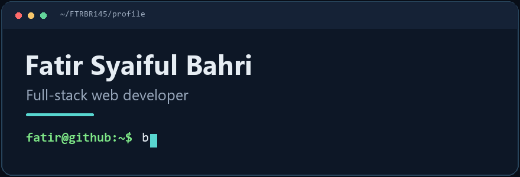

<picture>
  <source media="(prefers-reduced-motion: reduce)" srcset="./assets/terminal-header.png">
  
</picture>

 

[Portofolio](https://FTRBR145.github.io/Portofolio.Dev/) · [Proyek](#proyek-pilihan) · [Teknologi](#teknologi) · [Kontak](#kontak)

## Halo, saya Fatir

Saya membangun aplikasi web dari antarmuka sampai API dan database. Latar belajar saya di PPLG, SMKN 1 Ciomas; sekarang saya banyak berkarya dengan React, Node.js, dan MySQL.

## Proyek pilihan

| Proyek | Yang saya buat |
| :--- | :--- |
| **[TabunganQu](https://github.com/FTRBR145/TabunganQu-Capstone)** | Aplikasi keuangan pribadi untuk mencatat pemasukan, pengeluaran, dan target tabungan. `React` · `Express` · `MySQL` |
| **[Cariklub](https://github.com/FTRBR145/cariklub-app)** | Katalog klub olahraga dengan pencarian berdasarkan nama atau negara. `HTML` · `CSS` · `JavaScript` |
| **[MasakApa](https://github.com/FTRBR145/masak-apa)** | Eksplorasi antarmuka aplikasi resep dan ide masakan. `React` · `TypeScript` · `Vite` |
| **[Portofolio.Dev](https://github.com/FTRBR145/Portofolio.Dev)** | Website portofolio pribadi dengan HTML, CSS, dan JavaScript tanpa framework frontend. [Lihat website ↗](https://FTRBR145.github.io/Portofolio.Dev/) |

## Teknologi

**Frontend** — React · TypeScript · JavaScript · HTML · CSS  
**Backend & data** — Node.js · Express · REST API · MySQL  
**Workflow** — Git · Vite

## Kontak

Terbuka untuk kolaborasi dan diskusi seputar pengembangan web.

[Email](mailto:fatirbahri45@gmail.com) · [GitHub](https://github.com/FTRBR145) · [Portofolio](https://FTRBR145.github.io/Portofolio.Dev/)
